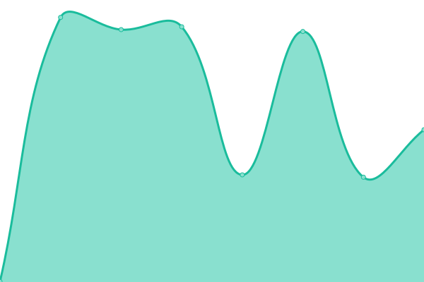
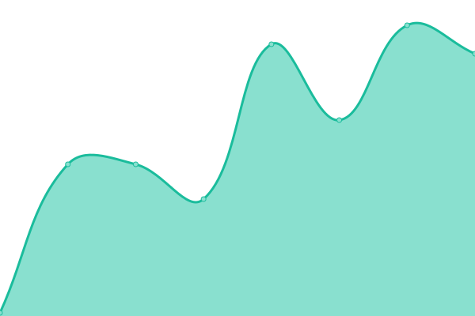

# [📈 Live Status](https://GTOLAB.github.io/upptime): <!--live status--> **🟩 All systems operational**

This repository contains the open-source uptime monitor and status page for [GTOLAB](https://GTOLAB.github.io/upptime), powered by [Upptime](https://github.com/upptime/upptime).

With [Upptime](https://upptime.js.org), you can get your own unlimited and free uptime monitor and status page, powered entirely by a GitHub repository. We use [Issues](https://github.com/GTOLAB/upptime/issues) as incident reports, [Actions](https://github.com/GTOLAB/upptime/actions) as uptime monitors, and [Pages](https://GTOLAB.github.io/upptime) for the status page.

<!--start: status pages-->
<!-- This summary is generated by Upptime (https://github.com/upptime/upptime) -->
<!-- Do not edit this manually, your changes will be overwritten -->
<!-- prettier-ignore -->
| URL | Status | History | Response Time | Uptime |
| --- | ------ | ------- | ------------- | ------ |
|  [GTOLAB Landing](https://www.gtolab.com) | 🟩 Up | [gtolab-landing.yml](https://github.com/GTOLAB/upptime/commits/HEAD/history/gtolab-landing.yml) | 

 469ms
     
 | 

<a href="https://GTOLAB.github.io/upptime/history/gtolab-landing">100.00%</a>
    

|  [GTOLAB App](https://app.gtolab.com) | 🟩 Up | [gtolab-app.yml](https://github.com/GTOLAB/upptime/commits/HEAD/history/gtolab-app.yml) | 

 300ms
     
 | 

<a href="https://GTOLAB.github.io/upptime/history/gtolab-app">100.00%</a>
    

|  [GTOLAB DB](https://app.gtolab.com/api/health) | 🟩 Up | [gtolab-db.yml](https://github.com/GTOLAB/upptime/commits/HEAD/history/gtolab-db.yml) | 

 54ms
     
 | 

<a href="https://GTOLAB.github.io/upptime/history/gtolab-db">100.00%</a>
    

<!--end: status pages-->

[**Visit our status website →**](https://GTOLAB.github.io/upptime)

## 📄 License

- Powered by: [Upptime](https://github.com/upptime/upptime)
- Code: [MIT](./LICENSE) © [Anand Chowdhary](https://anandchowdhary.com), supported by [Pabio](https://pabio.com)
- Data in the `./history` directory: [Open Database License](https://opendatacommons.org/licenses/odbl/1-0/)
